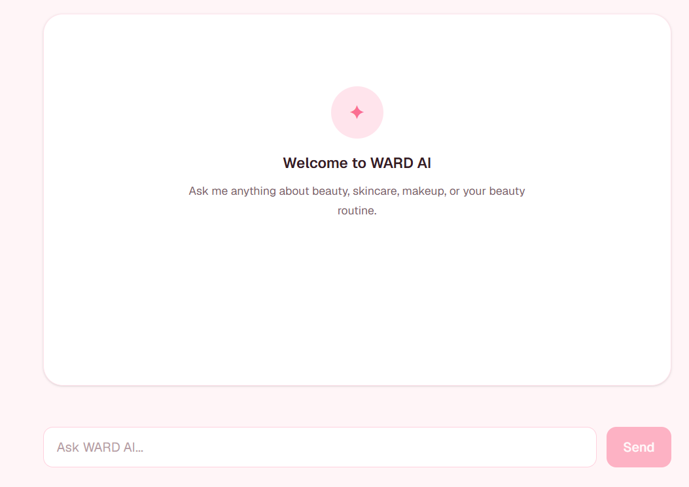

# WARD-AI-BEAUTY-ASSISTANT-
## WARD AI

WARD AI is a streaming AI beauty assistant built for the WARD beauty brand.

It supports real-time streamed responses, multiple conversation turns,
interruptible generation, Arabic and English conversations, and
responsive mobile-friendly chat.

### AI Assistant Preview


 (Add WARD AI preview to README)
 (feat: add FE-07 tool results and structured output)

This is a [Next.js](https://nextjs.org) project bootstrapped with [`create-next-app`](https://nextjs.org/docs/app/api-reference/cli/create-next-app).

## Getting Started

First, run the development server:

```bash
npm run dev
# or
yarn dev
# or
pnpm dev
# or
bun dev
```

Open [http://localhost:3000](http://localhost:3000) with your browser to see the result.

You can start editing the page by modifying `app/page.tsx`. The page auto-updates as you edit the file.

This project uses [`next/font`](https://nextjs.org/docs/app/building-your-application/optimizing/fonts) to automatically optimize and load [Geist](https://vercel.com/font), a new font family for Vercel.

## Learn More

To learn more about Next.js, take a look at the following resources:

- [Next.js Documentation](https://nextjs.org/docs) - learn about Next.js features and API.
- [Learn Next.js](https://nextjs.org/learn) - an interactive Next.js tutorial.

You can check out [the Next.js GitHub repository](https://github.com/vercel/next.js) - your feedback and contributions are welcome!

## Deploy on Vercel

The easiest way to deploy your Next.js app is to use the [Vercel Platform](https://vercel.com/new?utm_medium=default-template&filter=next.js&utm_source=create-next-app&utm_campaign=create-next-app-readme) from the creators of Next.js.

Check out our [Next.js deployment documentation](https://nextjs.org/docs/app/building-your-application/deploying) for more details.
(Final Capstone Project FlyRank AI)

//////update ///////
## FE-07 — Tool Results and Structured Output

### `fetchMetaTags`

WARD AI includes a server-side AI tool called `fetchMetaTags`. The tool fetches webpage metadata and returns the result as structured data that is rendered as a dedicated UI component.

### Tool Purpose

The `fetchMetaTags` tool receives a webpage URL, fetches the webpage server-side, and extracts the following metadata:

- Page title
- Meta description
- Canonical URL
- Open Graph image

### Tool Input Schema

The tool uses Zod to validate its input.

```ts
{
  url: string;
}
The url field must be a valid URL.

Tool Return Shape

The tool returns a structured object:

{
  url: string;
  title: string | null;
  description: string | null;
  canonical: string | null;
  ogImage: string | null;
}
Tool Execution

The tool is registered in the AI route:

app/api/chat/route.ts

The tool definition is located at:

lib/ai/tools/fetch-meta-tags.ts

The tool performs the webpage fetch and metadata extraction inside its server-side execute() function.

Tool Lifecycle UI

WARD AI renders the tool lifecycle as distinct UI states rather than displaying raw tool data or JSON.

1. Input Streaming

The UI indicates that the webpage analysis tool is being prepared and its input is being streamed.

2. Input Available

The UI displays the webpage URL that the AI selected for analysis.

3. Output Available

When the tool successfully completes, the returned metadata is rendered as a dedicated Webpage Metadata component.

The component displays:

URL
Title
Description
Canonical URL
Open Graph image

This makes the structured tool result readable as a real UI component instead of a JSON dump.

4. Output Error

If the webpage cannot be fetched or the tool execution fails, WARD AI displays a dedicated error state instead of crashing.

Example error state:

Couldn't analyze this webpage

An error occurred.
Example Tool Flow
User
  ↓
WARD AI
  ↓
fetchMetaTags
  ↓
Fetch webpage server-side
  ↓
Extract metadata
  ↓
Structured result
  ↓
Webpage Metadata component
Error Flow
User
  ↓
WARD AI
  ↓
fetchMetaTags
  ↓
Fetch fails
  ↓
Tool error
  ↓
Designed error UI
FE-07 Implementation
AI SDK useChat for the chat interface
Server-side AI tool execution
Zod input schema validation
Structured tool output
Typed tool lifecycle rendering
Webpage metadata result component
Dedicated tool error state
Successful and failed tool execution testing
Files
app/api/chat/route.ts
lib/ai/tools/fetch-meta-tags.ts
components/aichat.tsx
components/tool-meta-tags.tsx
 (feat: add FE-07 tool results and structured output)
