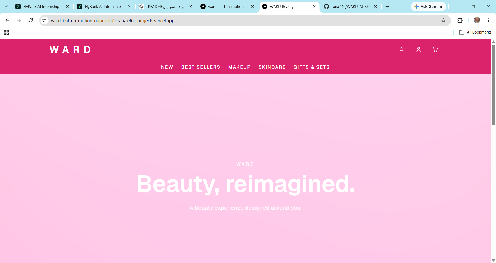

# WARD — AI Beauty Assistant & Interactive 3D Beauty Studio

## Project Brief

WARD is an AI-enhanced beauty experience designed for people who want practical, conversational guidance across skincare, makeup, and personal care without navigating complex beauty information on their own. It combines a streaming AI beauty assistant with an interactive 3D beauty studio, allowing users to explore beauty content through both conversation and visual interaction. I chose this idea to turn a familiar beauty interface into a meaningful AI-powered experience while applying the frontend engineering, accessibility, interaction, 3D, and production skills developed throughout the Frontend AI Engineering track.


## Production

# Deployment Checklist

WARD was reviewed against the production deployment requirements before final submission.

### Application & Build

* [x] Production build completed successfully with `npm run build`
* [x] TypeScript compilation completed without errors
* [x] Application deployed to Vercel
* [x] Production deployment status is **Ready**
* [x] Production URL loads successfully without requiring Vercel authentication
* [x] Environment variables configured in Vercel
* [x] OpenRouter API key kept server-side

### AI & API

* [x] AI assistant works in production
* [x] Streaming AI responses verified
* [x] AI provider errors handled with a user-facing retry state
* [x] Maximum conversation size enforced
* [x] Maximum message length enforced
* [x] Streaming request duration limited with `maxDuration`
* [x] AI API key is not exposed through client-side environment variables

### Accessibility & Quality

* [x] Lighthouse Accessibility score: **100**
* [x] Lighthouse Best Practices score: **100**
* [x] Lighthouse SEO score: **100**
* [x] WCAG-focused accessibility issues reviewed and improved
* [x] Color contrast improvements verified
* [x] Landmark structure reviewed
* [x] Interactive states and error communication reviewed

### Testing

* [x] Automated test suite runs successfully
* [x] **17 tests passed**
* [x] Statement coverage: **70%**
* [x] Branch coverage: **81.31%**
* [x] Function coverage: **84.61%**
* [x] Line coverage: **74.24%**
* [x] Critical AI UI and metadata tool behavior covered by tests

### Production Verification

* [x] Homepage verified in production
* [x] Navigation verified
* [x] Signature Shader verified
* [x] Interactive 3D Beauty Studio verified
* [x] WARD AI Assistant verified
* [x] Streaming response verified
* [x] Error/retry behavior verified
* [x] Production API behavior verified

### Rollback Plan

If a production deployment introduces a regression, the application can be rolled back by reverting the problematic commit and redeploying the last known-good commit from `main` through Vercel.

The repository history and Vercel deployment history provide the previous production versions needed for recovery.

### Monitoring & Operations

Production issues are monitored through Vercel deployment status and runtime logs. API and AI failures can be investigated through server-side logs without exposing provider credentials to the client.

### Final Sign-off

**Deployment status:** Ready for submission

**Production URL:**
`https://ward-button-motion-oqpexskq9-rana746s-projects.vercel.app/`

**Final verification:** Production deployment, AI functionality, automated tests, accessibility, SEO, and best-practice audits completed successfully.

**Signed off:** WARD Frontend AI Engineering Capstone


**Live Demo:** https://ward-button-motion-oqpexskq9-rana746s-projects.vercel.app/

**Repository:** https://github.com/rana746/WARD-AI-BEAUTY-ASSISTANT-

The application is deployed to Vercel and the production AI flow is connected to OpenRouter through a server-side API route.

---

# Features

* AI-powered WARD beauty assistant
* Streaming AI responses
* Beauty, skincare, makeup, and personal-care guidance
* Automatic language matching between user and assistant
* Tool-enabled AI workflow
* `fetchMetaTags` tool for webpage metadata
* AI error and retry states
* Interactive 3D WARD Beauty Studio
* Signature shader hero experience
* Interactive visual effects and motion
* Responsive interface
* Accessibility improvements
* Production input validation
* Conversation and message limits
* Streaming request timeout
* Vercel production deployment

---

# Screenshots

## Home



## 3D Animation Page


## AI WARD Assistant


---

# Project Evolution

WARD was built incrementally across the Frontend AI Engineering assignments.

## FE-07 — Tool Results & Structured Output

The AI interaction was extended beyond a basic chat response by introducing tool usage.

The project includes a `fetchMetaTags` tool that can retrieve metadata from a webpage when the AI workflow needs it.

The tool is implemented separately from the API route:

```text
lib/ai/tools/fetch-meta-tags.ts
```

This separation keeps tool logic modular and makes future tools easier to add.

---

# FE-08 — Error States & Edge Cases

The AI interface was designed to handle failure states instead of assuming every request succeeds.

The project includes handling for cases such as:

* Invalid or unavailable URLs
* Failed AI requests
* Streaming failures
* Retry states
* User-friendly error messages

Instead of exposing internal errors directly to users, the interface provides a clear recovery path.

---

# FE-09 — Testing & CI

Testing and continuous integration were added to improve reliability during development.

The project uses **Vitest** with **V8 coverage** for automated component testing.

## Test Results

The current test suite includes:

* **2 test files passed**
* **17 tests passed**
* **0 failed tests**

Coverage results:

| Metric     |   Coverage |
| ---------- | ---------: |
| Statements |    **70%** |
| Branches   | **81.31%** |
| Functions  | **84.61%** |
| Lines      | **74.24%** |

Component-level coverage includes:

| Component            | Statements |
| -------------------- | ---------: |
| `aichat.tsx`         | **59.18%** |
| `tool-meta-tags.tsx` | **95.23%** |

The overall statement coverage of **70%** exceeds the Capstone requirement of **50% component coverage**.

## Covered Behavior

The tests verify important application behavior including:

* WARD AI welcome state
* User input handling
* Send button state
* Message submission
* Input clearing after submission
* AI chat interaction behavior
* Webpage metadata tool output

The test suite was run with:

```bash
npm test -- --coverage
```

The latest run completed successfully with all **17 tests passing**.

The coverage report was generated using Vitest's V8 coverage provider.


---

# FE-AA1 — Button Motion & Interaction States

Interactive controls were refined with motion and interaction states.

The work focused on making buttons and interactive elements feel responsive through states such as:

* Hover
* Press
* Focus
* Interaction feedback
* Motion transitions

The goal was to make the interface feel intentional rather than static.

---

# FE-AA2 — Interactive 3D Beauty Studio

WARD was extended into an interactive 3D beauty experience.

The 3D experience uses Three.js-based rendering and React integration to create a visual beauty studio containing WARD-inspired products and interactive elements.

The 3D work focused on:

* Product visualization
* Interactive scene elements
* Lighting and visual presentation
* Materials
* Camera composition
* User interaction
* Performance-aware rendering

The 3D experience became one of the main visual elements of the WARD project.

---

# FE-AA3 — Signature Shader Hero

The project was further enhanced with a custom signature shader hero experience.

The shader creates an animated visual effect for the hero section and gives the interface a more distinctive visual identity.

The shader work focused on:

* Animated visual effects
* GPU-based rendering concepts
* Smooth visual transitions
* Integration with the existing WARD interface
* Maintaining usability while adding visual complexity

The Signature Shader was implemented as a separate feature so it could be integrated into the existing page without changing the rest of the application architecture.

---

# FE-10 — Accessibility & Production Quality

Accessibility was treated as part of the implementation process rather than only a final visual check.

The project went through accessibility and performance review using browser auditing tools.

Improvements included:

* Better brand color contrast
* Improved navbar contrast
* Accessible color adjustments
* Removal of a nested `main` landmark
* Improved readability
* More intentional interactive states

The brand colors were adjusted while keeping the intended WARD visual identity.

The goal was to improve accessibility without losing the visual character of the design.

---

# FE-11 — Production Deployment

The final project was promoted to production using Vercel.

The production process included:

* Environment variable configuration
* Production deployment
* Production AI debugging
* Streaming verification
* Input protection
* Request duration limits
* Production smoke testing

The final production URL is:

**https://ward-button-motion-oqpexskq9-rana746s-projects.vercel.app/**

---

# Tech Stack

* Next.js
* React
* TypeScript
* Tailwind CSS
* Three.js
* React Three Fiber
* AI SDK
* OpenRouter
* Vercel
* Git
* GitHub

---

# AI Architecture

The AI assistant uses a server-side API route:

```text
app/api/chat/route.ts
```

The AI configuration is separated into:

```text
lib/ai/config.ts
```

Tool functionality is separated into:

```text
lib/ai/tools/fetch-meta-tags.ts
```

The simplified request flow is:

```text
User
  |
  v
WARD AI UI
  |
  v
POST /api/chat
  |
  v
Request validation
  |
  v
convertToModelMessages()
  |
  v
streamText()
  |
  v
OpenRouter
  |
  v
AI model
  |
  v
Streaming response
  |
  v
WARD AI UI
```

---

# AI Configuration

The AI model is configured through OpenRouter.

The current implementation uses the OpenRouter free model router:

```ts
const openrouter = createOpenRouter({
  apiKey: process.env.OPENROUTER_API_KEY,
});

export const model = openrouter("openrouter/free");
```

The model and system prompt are kept outside the UI so that AI behavior can be changed without modifying the chat interface.

---

# WARD AI System Prompt

The system prompt defines WARD AI as a beauty assistant focused on:

* Beauty
* Skincare
* Makeup
* Personal care
* Beauty routines

The assistant is also instructed to:

* Detect the user's language
* Respond in the same language
* Use natural conversational Arabic when the user writes Arabic
* Keep responses friendly and concise
* Ask follow-up questions when additional context is needed
* Avoid diagnosing medical conditions
* Recommend professional healthcare support for serious or persistent concerns

---

# Streaming

The application uses AI SDK streaming rather than waiting for the complete response.

The core implementation uses:

```ts
streamText()
```

and returns the response through:

```ts
toUIMessageStreamResponse()
```

This allows the user to see the AI response as it is generated instead of waiting for the entire response.

---

# Tool Architecture

The `fetchMetaTags` tool is implemented independently from the main API route.

```text
app/api/chat/route.ts
        |
        v
      tools
        |
        v
fetchMetaTags
```

This keeps the route responsible for request handling and streaming while the tool handles webpage metadata functionality.

---

# Production Safeguards

The AI endpoint is publicly accessible, so basic protection was added to reduce trivial abuse and unnecessary API usage.

## Maximum conversation size

The route accepts a maximum of:

```text
10 messages
```

Requests containing more than 10 messages return:

```text
400 Bad Request
```

This was verified locally using a request containing 11 messages.

## Maximum message size

Individual messages are limited to:

```text
2000 characters
```

Requests exceeding the limit are rejected before being forwarded to the AI provider.

## Streaming timeout

The API route defines:

```ts
export const maxDuration = 30;
```

This prevents a streaming request from remaining active indefinitely.

## Server-side API key

The OpenRouter API key is stored as an environment variable.

It is never exposed through a `NEXT_PUBLIC_*` variable and is only accessed by the server-side API route.

---

# Environment Variables

Create a `.env.local` file in the project root.

| Variable             | Required | Description                                   |
| -------------------- | -------- | --------------------------------------------- |
| `OPENROUTER_API_KEY` | Yes      | Server-side API key used to access OpenRouter |

Example:

```env
OPENROUTER_API_KEY=your_openrouter_api_key
```

Never commit `.env.local` or expose the API key in client-side code.

---

# Getting Started

## Prerequisites

You need:

* Node.js
* npm
* An OpenRouter API key

## Clone the repository

```bash
git clone https://github.com/rana746/WARD-AI-BEAUTY-ASSISTANT-.git
cd WARD-AI-BEAUTY-ASSISTANT-
```

## Install dependencies

```bash
npm install
```

## Configure environment variables

Create:

```text
.env.local
```

Add:

```env
OPENROUTER_API_KEY=your_openrouter_api_key
```

## Start the development server

```bash
npm run dev
```

Open:

```text
http://localhost:3000
```

---

# Project Structure

A simplified project structure:

```text
WARD/
├── app/
│   ├── api/
│   │   └── chat/
│   │       └── route.ts
│   └── ...
│
├── components/
│   └── ...
│
├── lib/
│   └── ai/
│       ├── config.ts
│       └── tools/
│           └── fetch-meta-tags.ts
│
├── public/
│   └── screenshots/
│       ├── Home.png
│       ├── 3D ANIMATION PAGE.png
│       └── AI WARD ASSISTSNT.png
│
├── README.md
├── package.json
└── ...
```

---

# Key Technical Decisions

## Server-side AI route

The AI request is handled through a server-side route instead of exposing the provider directly to the browser.

This keeps the API key private and gives the application a place to validate requests and control AI usage.

## Streaming

Streaming was selected to create a more responsive conversational experience.

## Modular AI configuration

The model and system prompt are stored in:

```text
lib/ai/config.ts
```

This keeps provider configuration separate from the UI.

## Separate AI tools

AI tools are implemented independently so that the application can grow without turning the main route into a large monolithic file.

## Input caps

Input limits were selected as a practical production safeguard for a small public application.

They reduce the risk of unnecessarily large requests consuming AI provider credits without requiring additional rate-limiting infrastructure.

## Progressive enhancement

The project evolved incrementally. New AI, 3D, shader, accessibility, and production features were added without replacing the entire application architecture each time.

---

# Accessibility & UX Decisions

Accessibility improvements were made while preserving the visual direction of WARD.

The project focused on:

* Color contrast
* Navbar readability
* Landmark structure
* Interactive feedback
* Error communication
* Responsive behavior

The visual identity was refined rather than removed in favor of generic accessible defaults.

---

# Testing & Browser Coverage

Production smoke testing covers:

* Homepage loading
* Navigation
* Signature Shader
* 3D experience
* AI Assistant
* Streaming AI responses
* Error states
* Production API behavior

The assignment's target browser coverage is:

* Chrome
* Firefox
* Safari
* Mobile Safari

Chrome and Firefox were part of the available development/testing workflow.

Safari and Mobile Safari should be verified on a real Apple device or dedicated browser-testing environment before claiming complete Safari coverage.

---

# Production Debugging Example

During production testing, the AI endpoint initially returned:

```text
200 OK
```

but the chat interface displayed a retry state.

The production logs revealed that the Authorization header contained an invalid value caused by the OpenRouter API key configuration.

The environment variable was corrected, the exposed key was rotated, and the production deployment was redeployed.

After the correction, the production AI assistant successfully generated responses.

This was an example of using production logs rather than assuming that an HTTP `200` response meant the entire streaming workflow had succeeded.

---

# Git Workflow

Development was organized using feature branches and merges into `main`.

Examples of commits include:

```text
feat: add interactive WARD 3D beauty studio
feat: add signature shader hero
feat: add button motion and interaction states
feat: add production safeguards to AI route
fix: improve navbar contrast
fix: update brand colors for accessibility
fix: remove nested main landmark
```

The final production safeguards were added to `main` after integrating the latest Signature Shader and accessibility work.

---

# How AI Tools Built This

AI tools were used as development assistants throughout the project.

They were used for:

* Understanding assignment requirements
* Exploring implementation approaches
* Debugging Next.js and TypeScript issues
* Working with the AI SDK
* Designing the WARD AI system prompt
* Structuring AI tools
* Debugging streaming behavior
* Reviewing accessibility issues
* Investigating production errors
* Exploring 3D and shader implementation approaches
* Improving documentation

AI assistance was not treated as a one-click application generator.

The developer reviewed generated suggestions, integrated them into the existing codebase, ran the application locally, tested behavior, investigated errors, and made implementation decisions during the development process.

A concrete example was the production AI failure.

The API returned `200 OK`, but the user interface displayed `Try again`. Production logs were inspected and revealed an invalid Authorization header caused by the OpenRouter API key configuration. The key was rotated, the Vercel environment variable was updated, and the production deployment was tested again.

Another concrete example was production protection. AI assistance was used to design input validation for the `/api/chat` route. The implementation was then tested locally by sending 11 messages and verifying that the route returned:

```text
400 Bad Request
```

instead of forwarding the oversized conversation to the AI provider.

The final implementation was therefore developed through an iterative process of AI assistance, code review, local testing, debugging, and manual verification.

---

# Deployment

The application is deployed through Vercel.

The deployment flow is:

```text
Local Development
       |
       v
Git
       |
       v
GitHub
       |
       v
main
       |
       v
Vercel
       |
       v
Production
```

Environment variables are configured through the Vercel project settings.

---

# Production URL

**https://ward-button-motion-oqpexskq9-rana746s-projects.vercel.app/**

---

# Repository

**https://github.com/rana746/WARD-AI-BEAUTY-ASSISTANT-**

---

# Final Notes

WARD demonstrates the progression from a standard frontend interface into a production-oriented AI frontend application.

The project combines:

* Frontend engineering
* AI interaction
* Tool-enabled workflows
* Streaming
* Error handling
* Accessibility
* Testing
* Motion
* 3D graphics
* Shader effects
* Production deployment
* Basic AI API protection

Built as part of the Frontend AI Engineering track.
